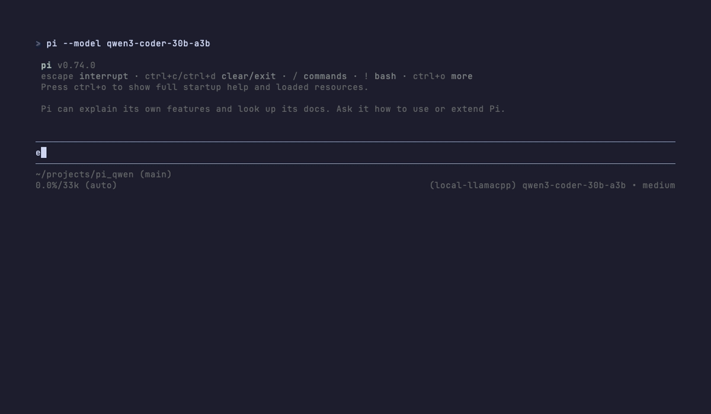

# pi_qwen

Run [pi](https://pi.dev) — a minimal terminal coding agent — against a **local** [Qwen3-Coder-30B-A3B-Instruct](https://huggingface.co/Qwen/Qwen3-Coder-30B-A3B-Instruct) model served by [llama.cpp](https://github.com/ggml-org/llama.cpp), all on Apple Silicon.

No API keys. No cloud round-trips. All inference on your machine.



## Why this combo

- **Qwen3-Coder-30B-A3B-Instruct** is a Mixture-of-Experts coding model: 30B total parameters, but only ~3B are active per token. That makes it surprisingly fast on consumer Apple Silicon while keeping the quality of a much larger model, and the coder-tuned weights track function-level and repo-level tasks better than the base Qwen3-30B-A3B.
- **llama.cpp** has the most mature Metal backend and ships precompiled via Homebrew — no Xcode required.
- **pi** is an OpenAI-API-compatible coding agent, so it talks to llama.cpp's HTTP server like any other provider.

## Tested on

- Apple M1 Max, 64 GB RAM, macOS 26.3 (`arm64`)
- llama.cpp via Homebrew (`b9100`)
- pi `latest`
- Quant: `Qwen3-Coder-30B-A3B-Instruct-Q5_K_M.gguf` (~21 GB on disk, ~24 GB resident with 32k context)

Measured throughput on this hardware: **~594 tok/s prefill (pp512)**, **~409 tok/s prefill (pp8192)**, and **~51 tok/s decode (tg128)**. See [Benchmarking](#benchmarking).

Should work on any Apple Silicon Mac with ≥ 32 GB RAM. Bigger context windows or higher-bit quants need more.

## Quickstart

```bash
# 1. Install llama.cpp (Metal-enabled, precompiled)
brew install llama.cpp

# 2. Install pi
curl -fsSL https://pi.dev/install.sh | sh

# 3. Download the model (~21 GB)
pip install -U "huggingface_hub[cli]" hf_transfer
mkdir -p ~/models/qwen3-coder-30b-a3b && cd ~/models/qwen3-coder-30b-a3b
HF_HUB_ENABLE_HF_TRANSFER=1 hf download \
  unsloth/Qwen3-Coder-30B-A3B-Instruct-GGUF \
  Qwen3-Coder-30B-A3B-Instruct-Q5_K_M.gguf --local-dir .

# 4. Install the helper scripts
mkdir -p ~/bin
cp scripts/qwen-serve scripts/qwen-test scripts/fetch-template ~/bin/
chmod +x ~/bin/qwen-serve ~/bin/qwen-test ~/bin/fetch-template
# Add ~/bin to PATH if you haven't already:
# echo 'export PATH="$HOME/bin:$PATH"' >> ~/.zshrc && source ~/.zshrc

# 5. Install the pi provider config
mkdir -p ~/.pi/agent
cp config/models.json ~/.pi/agent/models.json

# 6. Fetch Qwen's official chat template (needed for tool calling — see "Tool calling" below)
fetch-template

# 7. Start the server (leave it running)
qwen-serve

# 8. From another terminal, smoke-test
qwen-test "reply with just: hello"

# 9. Run pi against the local model
cd /path/to/some/project
pi --model qwen3-coder-30b-a3b
```

## Daily use

Once everything from Quickstart is in place, the day-to-day cycle is two commands in two terminals:

```bash
# Terminal 1 — start the server (leave it running)
qwen-serve

# Terminal 2 — drop into pi against the local model
cd /path/to/your/project
pi --model qwen3-coder-30b-a3b
```

Exit pi with `/exit` or Ctrl-D. The server keeps running in Terminal 1 across multiple pi sessions; stop it with Ctrl-C when you're done for the day.

## How the pieces fit

```
┌─────────┐    HTTP /v1/chat/completions   ┌──────────────┐    Metal    ┌──────────┐
│   pi    │ ──────────────────────────────▶│ llama-server │ ──────────▶ │   GPU    │
│ (agent) │                                │  (llama.cpp) │             │ (M-chip) │
└─────────┘                                └──────────────┘             └──────────┘
                                                  ▲
                                                  │ reads
                                                  ▼
                                         ~/models/...Q5_K_M.gguf
```

pi sees an OpenAI-compatible endpoint. llama-server does the actual inference on Metal. Your model file sits on disk and is memory-mapped at load time.

## The scripts

### `qwen-serve`
Starts `llama-server` with the flag set this repo has settled on. Honors env-var overrides:

```bash
qwen-serve                                  # defaults
PORT=8081 CTX=65536 qwen-serve              # bigger context, different port
MODEL=~/models/other.gguf qwen-serve        # swap the model file
ALIAS=my-model qwen-serve                   # change the model id pi sees
```

Key flags it sets:
- `-ngl 99` — offload all layers to Metal GPU. Free on Apple Silicon since memory is unified.
- `-c 32768` — 32k context. Bump to 65536/131072 if you need long sessions and have headroom.
- `-fa on` — flash attention (new llama.cpp requires explicit `on`/`off`/`auto`).
- `--jinja` — render the chat template (Qwen's, via `--chat-template-file`).
- `--chat-template-file <path>` — load Qwen's official chat template instead of the GGUF-embedded one. See [Tool calling](#tool-calling) for why.
- `--temp 0.6 --top-p 0.95 --top-k 20` — Qwen's official sampler recommendations.

### `qwen-test`
Single-shot prompt against the running server. Useful for sanity checks.

```bash
qwen-test                          # default: "reply with just: hello"
qwen-test "what is 2+2"            # custom prompt
PORT=8081 qwen-test "ping"         # different port
```

### `fetch-template`
Downloads Qwen's official chat template from HuggingFace and writes it to `~/models/qwen3-coder-30b-a3b/templates/qwen3-coder-official.jinja`, where `qwen-serve` looks for it. Run once after install. See [Tool calling](#tool-calling) for why this is needed.

```bash
fetch-template                                              # defaults
DEST=~/other/place/template.jinja fetch-template            # custom location
```

## Tool calling

pi needs the model to emit **structured tool calls**, not text. By default, the Unsloth Q5_K_M GGUF ships with an embedded chat template that has a tool-call bug: the model produces inner `<function=...>` blocks without the outer `<tool_call>` wrapper Qwen expects. llama-server then can't parse those back into the `tool_calls` field of the response, pi sees raw text, no tools execute, and the agent appears to hallucinate that it's running commands.

The fix is to load Qwen's official chat template explicitly via `--chat-template-file`. That's what `fetch-template` downloads and `qwen-serve` wires in.

Verify it's wired up correctly after starting `qwen-serve`:

```bash
curl -s http://127.0.0.1:8080/props | python3 -c "
import sys, json
d = json.load(sys.stdin)
ct = d.get('chat_template','')
print('template loaded:', bool(ct), 'length:', len(ct))
print('first line:', ct.split(chr(10))[0])
"
```

If the first line is `` you've got Qwen's official template. If it starts with an Unsloth copyright header, the override didn't take — re-run `fetch-template` and re-check the file path in `qwen-serve`.

Smoke test in pi: ask `explain the purpose of this codebase` from inside this repo. You should see pi actually execute `find` and `read README.md` as tool calls (rendered as `$ find ...` and `read README.md` blocks in the TUI), not raw `<function=bash>` XML.

### Using Tools with pi/qwen

This setup is designed to work with pi's tool calling capabilities. The key configuration for enabling tool usage includes:

1. **Proper Template Loading**: The `fetch-template` script downloads Qwen's official chat template which fixes tool-call format issues in the GGUF's embedded template.

2. **Model Configuration**: The `models.json` configuration file in `config/` properly maps the model ID to the server alias.

3. **Example Usage**: Once the server is running, you can test tool usage in pi by asking it to perform tasks like:
   ```
   pi --model qwen3-coder-30b-a3b
   ```

## Layout of this repo

```
pi_qwen/
├── README.md            # this file
├── LICENSE              # MIT
├── scripts/
│   ├── qwen-serve       # start llama-server with sensible defaults
│   ├── qwen-test        # one-shot smoke test
│   └── fetch-template   # fetch Qwen's official chat template (fixes tool calls)
├── bench/
│   └── throughput.sh    # llama-bench wrapper for pp/tg tok/s
├── demo/
│   ├── pi-qwen.tape     # vhs script for the README demo
│   └── smoke.tape       # minimal vhs script to verify the toolchain
└── config/
    └── models.json      # pi provider config (copy to ~/.pi/agent/)
```

## Choosing a quant

| Quant     | File size | Quality | Notes                                 |
|-----------|-----------|---------|---------------------------------------|
| Q4_K_M    | ~18 GB    | Good    | Default if RAM is tight (32 GB Macs). |
| **Q5_K_M**| ~21 GB    | Better  | Sweet spot for 64 GB+ Macs.           |
| Q6_K      | ~25 GB    | Great   | Marginal gain over Q5; rarely worth.  |
| Q8_0      | ~32 GB    | Near-FP | Diminishing returns; long load times. |
| Q3_K_M    | ~15 GB    | Fair    | For users with very limited disk space. |

Memory budget at 32k context ≈ model size + ~3 GB KV cache + ~1 GB overhead. Add ~3 GB per doubling of context.

## Troubleshooting

### Download is glacial (single-digit MB/s)
Set up `hf_transfer` and an HF token:
```bash
pip install -U hf_transfer
export HF_HUB_ENABLE_HF_TRANSFER=1
export HF_TOKEN=hf_xxxxxxxxxxxx   # from https://huggingface.co/settings/tokens
```

### `error: unknown value for --flash-attn`
Newer llama.cpp requires `-fa on` (or `off`/`auto`), not bare `-fa`. The script in this repo already uses the new form.

### pi doesn't see the model
```bash
pi --list-models
jq . ~/.pi/agent/models.json   # validate JSON
curl -s http://127.0.0.1:8080/v1/models | jq   # confirm server is up
```
The model `id` in `models.json` must match the `-a` alias passed to `llama-server` (both are `qwen3-coder-30b-a3b` here).

### Garbled or template-broken output
You probably forgot `--jinja`. Without it llama.cpp falls back to a generic template and Qwen3's chat tokens get mangled.

### Model writes `<function=bash>` instead of actually running tools
Tool-call format bug in the GGUF's embedded template. Run `fetch-template` and restart `qwen-serve`. See [Tool calling](#tool-calling).

### Out of memory at load
Drop the quant (Q5_K_M → Q4_K_M) or the context (`CTX=16384 qwen-serve`).

## Alternative: mistral.rs (Rust)

[mistral.rs](https://github.com/EricLBuehler/mistral.rs) is the Rust-native inference server. It supports Qwen3 MoE and Metal, and also serves an OpenAI-compatible API. The only structural difference for pi is the `baseUrl` and the model `id` (mistral.rs reports the loaded model as `default` unless overridden).

The catch on macOS: building it requires the Metal shader compiler, which ships only with **full Xcode** (not Command Line Tools). If you don't already have Xcode installed, llama.cpp is the friction-free path. If you do:

```bash
sudo xcode-select -s /Applications/Xcode.app/Contents/Developer
cargo install --git https://github.com/EricLBuehler/mistral.rs mistralrs-server --features metal

mistralrs-server --port 8080 gguf \
  -m ~/models/qwen3-coder-30b-a3b \
  -f Qwen3-Coder-30B-A3B-Instruct-Q5_K_M.gguf
```

Then change `id` to `default` in `models.json` and you're off.

## Benchmarking

### Throughput (`bench/throughput.sh`)

Reports raw inference speed via `llama-bench` — prompt processing (`pp`, prefill) and token generation (`tg`, decode), both in tok/s. This measures the model + your hardware, not pi.

```bash
# Stop qwen-serve first so the GPU isn't contended
./bench/throughput.sh
```

For a richer sweep — multiple prompt sizes, multiple generation lengths, and a combined prefill+decode test that resembles a real pi turn — call `llama-bench` directly:

```bash
llama-bench \
  -m ~/models/qwen3-coder-30b-a3b/Qwen3-Coder-30B-A3B-Instruct-Q5_K_M.gguf \
  -p 512,2048,8192 \
  -n 128,512 \
  -pg 8192,128 \
  -ngl 99 -fa 1 -r 3
```

Real run on Apple M1 Max, 64 GB, llama.cpp build `2e97c5f96 (9100)`:

```
| model                          |      size |  params | backend  | threads | fa |          test |             t/s |
| ------------------------------ | --------: | ------: | -------- | ------: | -: | ------------: | --------------: |
| qwen3moe 30B.A3B Q5_K - Medium | 20.23 GiB | 30.53 B | BLAS,MTL |       8 |  1 |         pp512 |   593.80 ± 4.38 |
| qwen3moe 30B.A3B Q5_K - Medium | 20.23 GiB | 30.53 B | BLAS,MTL |       8 |  1 |        pp2048 |   554.40 ± 0.51 |
| qwen3moe 30B.A3B Q5_K - Medium | 20.23 GiB | 30.53 B | BLAS,MTL |       8 |  1 |        pp8192 |   409.13 ± 7.86 |
| qwen3moe 30B.A3B Q5_K - Medium | 20.23 GiB | 30.53 B | BLAS,MTL |       8 |  1 |         tg128 |    50.76 ± 0.21 |
| qwen3moe 30B.A3B Q5_K - Medium | 20.23 GiB | 30.53 B | BLAS,MTL |       8 |  1 |         tg512 |    50.00 ± 0.11 |
| qwen3moe 30B.A3B Q5_K - Medium | 20.23 GiB | 30.53 B | BLAS,MTL |       8 |  1 |  pp8192+tg128 |   356.51 ± 2.71 |
```

Reading the numbers:
- **`pp512` → `pp8192`** (594 → 409 tok/s): prefill cost grows super-linearly. Long prompts dominate wall-clock time, not decode.
- **`tg128` ≈ `tg512`** (51 vs 50 tok/s): decode is steady regardless of generation length.
- **`pp8192+tg128`** (357 tok/s effective): combined prefill+decode for a realistic pi turn. This is closer to what you'll feel in practice than `pp512` alone.

MoE throughput moves with quant, batch size, context length, and how much else the GPU is doing.

Overrides for the wrapper:
```bash
PP=2048 TG=256 REPS=5 ./bench/throughput.sh     # bigger batches, more reps
MODEL=~/models/other.gguf ./bench/throughput.sh # benchmark a different model
NGL=0 ./bench/throughput.sh                     # CPU-only baseline (slow)
```

Run this once after install to confirm your hardware is performing, and again after any quant/flag change to catch regressions.

### Other benchmarks worth knowing about

- **Latency / time-to-first-token** — measures the path pi actually walks. Send timed requests to `/v1/chat/completions` and read the `timings` block llama-server returns.
- **Agent quality** — public coding-agent benchmarks like [Aider's polyglot eval](https://aider.chat/docs/leaderboards/) or HumanEval. They measure the model, not pi-with-the-model.
- **Your own prompt set** — the only thing that measures *your* workflow. A handful of representative tasks from your real work, run twice, eyeballed.

## Recording the demo

The GIF at the top of this README is generated with [vhs](https://github.com/charmbracelet/vhs) — a scripted terminal recorder. The tape lives in [`demo/pi-qwen.tape`](demo/pi-qwen.tape), so re-running it after a change is one command instead of "perform the demo perfectly again."

### Prerequisites

```bash
brew install vhs ttyd ffmpeg
```

`vhs` drives the recording, `ttyd` is the PTY web bridge it talks to, `ffmpeg` does the encode. All three must be on PATH.

### How a recording works

vhs spawns a headless Chrome that connects to a `ttyd`-hosted shell. It executes the `.tape` script keystroke-by-keystroke, screenshots each frame, and renders to the file named in the `Output` directive. **vhs does not start `qwen-serve`** — start it in a separate terminal first, otherwise pi will fail to connect and the recording will end early with `context canceled`.

### Record

```bash
qwen-serve                              # terminal 1
vhs demo/pi-qwen.tape                   # terminal 2
```

Output lands at `demo/pi-qwen.gif`.

### Iterate

`vhs serve` opens a local WebSocket preview — the tape re-renders on save, so you can tune `Sleep` durations and styling without burning a full render each time:

```bash
vhs serve
# edit demo/pi-qwen.tape in your editor; preview updates on save
```

### What the directives do

| Directive | What it controls |
|---|---|
| `Output demo/pi-qwen.gif` | Output path. Swap to `.mp4` or `.webm` for smaller files. |
| `Set FontSize 14` | Render size of glyphs. |
| `Set Width 1400 / Height 800` | Canvas in px. Bigger = sharper but heavier. |
| `Set Theme "..."` | One of vhs's bundled themes. |
| `Set TypingSpeed 50ms` | Per-keystroke delay for `Type`. |
| `Set PlaybackSpeed 1.5` | Speeds up the final video; useful when decode is slow. |
| `Hide ... Show` | Run commands without recording (great for `cd` + `clear`). |
| `Type "..."` | Types a string. |
| `Enter` | Submits. |
| `Sleep 60s` | Waits — vhs has no "wait for output" primitive, so you size this empirically. |

### GIF vs MP4

A 60-second decode at 1400×800 produces an **8–20 MB GIF**, which is close to GitHub's README image limit. If it bloats, change one line:

```
Output demo/pi-qwen.mp4
```

and embed in the README with `<video src="demo/pi-qwen.mp4" controls></video>`. GitHub renders it inline at roughly 1/10th the size.

## Layout of this repo

```
pi_qwen/
├── README.md            # this file
├── LICENSE              # MIT
├── scripts/
│   ├── qwen-serve       # start llama-server with sensible defaults
│   ├── qwen-test        # one-shot smoke test
│   └── fetch-template   # fetch Qwen's official chat template (fixes tool calls)
├── bench/
│   └── throughput.sh    # llama-bench wrapper for pp/tg tok/s
├── demo/
│   ├── pi-qwen.tape     # vhs script for the README demo
│   └── smoke.tape       # minimal vhs script to verify the toolchain
└── config/
    └── models.json      # pi provider config (copy to ~/.pi/agent/)
```

## Credits

- [Qwen team](https://qwenlm.github.io/) for the base model
- [Unsloth](https://huggingface.co/unsloth) for the GGUF quants used here
- [ggml-org/llama.cpp](https://github.com/ggml-org/llama.cpp) for the inference engine
- [pi](https://pi.dev) for the agent

## License

MIT — see [LICENSE](LICENSE).

## Acknowledgments

This README was co-written by Claude Code and the Qwen3-Coder-30B-A3B model with Pi.
